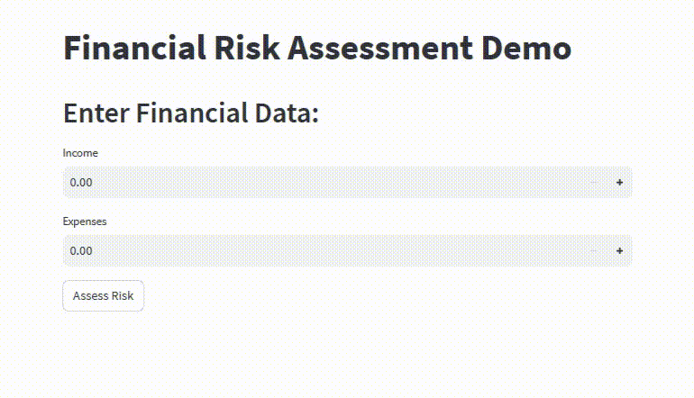

# Financial Risk Assessment Demo

This project is a demonstration of a Financial Risk Assessment application that predicts risk tolerance based on user-provided financial data. It combines machine learning models (Logistic Regression and LightGBM), FastAPI for the backend, and Streamlit for the frontend to create an interactive web application.

## Table of Contents
- [Overview](#overview)
- [Project Structure](#project-structure)
- [Getting Started](#getting-started)
- [Usage](#usage)
- [Demo](#demo)
- [Dependencies](#dependencies)

## Overview

The goal of this project is to showcase the integration of machine learning models into a web-based financial risk assessment tool. It includes:

- Data generation (mock data for demonstration purposes).
- Risk assessment models (Logistic Regression and LightGBM).
- A FastAPI backend for handling user requests.
- A Streamlit frontend for user interaction.

## Project Structure

The project is organized as follows:

```
financial_demo/
│
├── data/
│   └── financial_data.csv
│
├── scripts/
│   ├── generate_data.py
│   ├── risk_assessment.py
│   └── ...
│
├── models/
│   ├── risk_assessment_model.joblib
│   ├── risk_assessment_model_xgb.joblib
│   └── ...
│
├── app.py
├── streamlit_app.py
├── requirements.txt
└── README.md
```

- **data/:** Contains the mock financial dataset.

- **scripts/:** Includes Python scripts for data generation and model training.

- **models/:** Stores trained machine learning models.

- **app.py:** The FastAPI backend for risk assessment.

- **streamlit_app.py:** The Streamlit frontend for user interaction.

- **requirements.txt:** Lists project dependencies.

## Getting Started

To run the project locally, follow these steps:

1. Clone this repository to your local machine:

   ```bash
   git clone https://github.com/fshnkarimi/Financial-Risk-Assessment-using-LightGBM.git
   cd Financial-Risk-Assessment-using-LightGBM
   ```

2. Set up a virtual environment (optional but recommended):

   ```bash
   python -m venv venv
   source venv/bin/activate  # On Windows: venv\Scripts\activate
   ```

3. Install project dependencies:

   ```bash
   pip install -r requirements.txt
   ```

4. Generate mock financial data:

   ```bash
   python scripts/generate_data.py
   ```

5. Train the risk assessment model (Logistic Regression or LightGBM):

   ```bash
   python scripts/risk_assessment.py
   ```

6. Start the FastAPI backend:

   ```bash
   uvicorn app:app
   ```

7. In a separate terminal, run the Streamlit app:

   ```bash
   streamlit run streamlit_app.py
   ```

8. Access the Streamlit app in your web browser (usually at http://localhost:8501).

## Usage

1. Open the Streamlit app in your web browser.

2. Enter your financial data, including income and expenses.

3. Click the "Assess Risk" button to receive a risk assessment result.

## Demo




## Dependencies

- scikit-learn
- fastapi
- pydantic
- lightgbm
- streamlit
- joblib
- requests

For a complete list of dependencies, see [requirements.txt](requirements.txt).

